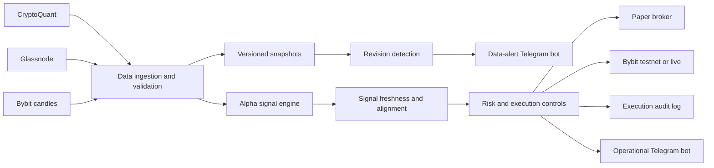

# CTA Crypto Execution Engine - Time Series Multi Factor Trading

A production-style crypto systematic trading engine that combines multi-source market data, modular alpha signals, time-aware portfolio execution, risk controls, data-revision monitoring, and routed Telegram alerts.

> This repository is a portfolio project demonstrating trading-system engineering. It is not investment advice, and no performance or profitability claim is made.

## Overview

The CTA Crypto Execution Engine turns hourly market and on-chain data into an aligned portfolio position and executes that target through paper, Bybit testnet, or live modes. The system is designed around operational concerns that are often missing from strategy prototypes: stale data, delayed signals, historical data revisions, process supervision, execution reconciliation, persistent audit trails, and alert routing.

## Architecture



## Key engineering features

- Multi-source hourly ingestion for Bybit, CryptoQuant, and Glassnode data.
- Atomic dataset updates, schema validation, retry scheduling, freshness checks, and retained snapshots.
- Revision detection using both an absolute numerical floor and a configurable percentage threshold.
- Nested JSON metric comparison for provider payloads containing exchange-level values.
- Modular transformations, statistical models, and entry/exit logic for multiple alpha signals.
- Timestamp-aware signal receipt tracking and portfolio alignment across delayed data sources.
- Early execution when all signals are ready, with controlled degraded execution after deadlines.
- Paper, testnet, and live execution modes with position reconciliation and a wallet kill switch.
- Separate Telegram routing for datafeed alerts and operational or order-execution alerts.
- Persistent CSV/JSON audit state and UTC daily log rotation.
- Unit coverage for revision thresholds, retry behavior, signal timing, and alert routing.

## Safety defaults

- `config_exe.py` defaults to Bybit `testnet` mode.
- Credentials are loaded from `.env`, which is excluded from Git.
- Generated data, snapshots, logs, paper state, and execution records are excluded from Git.
- The launcher checks price freshness before starting execution.
- Live mode should only be enabled after independent review and testnet validation.

## Repository structure

| Path | Purpose |
| --- | --- |
| `main.py` | Starts alerting, datafeeds, and the execution engine. |
| `datafeed_price.py` | Fetches and aligns Bybit candle data. |
| `datafeed_CQ.py` | Runs CryptoQuant ingestion and retry scheduling. |
| `datafeed_GN.py` | Runs Glassnode ingestion and retry scheduling. |
| `datafeed_utils.py` | Validation, snapshots, revision comparison, and alert metadata. |
| `alpha_signal.py` | Builds the active alpha signals. |
| `alpha_lib.py` | Defines alpha configurations and data alignment. |
| `lib/` | Transformation, model, and entry/exit logic libraries. |
| `execution.py` | Coordinates signal deadlines, target positions, and execution. |
| `paper_broker.py` | Simulates market execution and portfolio accounting. |
| `bybit_ccxt.py` | Handles Bybit connectivity, positions, orders, and kill-switch checks. |
| `telegram_father_bot.py` | Watches logs and routes alerts between Telegram bots. |
| `portfolio_execution_log.py` | Maintains the execution audit ledger. |
| `tests/` | Unit tests for critical timing, data, and alert behavior. |

## Getting started

### 1. Create the environment

Python 3.12 is recommended.

```powershell
conda create -n alphora python=3.12 -y
conda activate alphora
python -m pip install -r requirements.txt
```

If `conda` is not initialized in PowerShell, use:

```powershell
& "$env:USERPROFILE\miniconda3\Scripts\conda.exe" run -n alphora python -m pip install -r requirements.txt
```

### 2. Configure credentials

```powershell
Copy-Item .env.example .env
```

Complete the required values in `.env`. Never commit this file.

| Variable | Purpose |
| --- | --- |
| `CYBOTRADE_API_KEY` | Access to configured market and on-chain data sources. |
| `BYBIT_TESTNET_API_KEY`, `BYBIT_TESTNET_API_SECRET` | Bybit testnet execution. |
| `BYBIT_API_KEY`, `BYBIT_API_SECRET` | Bybit live execution; only required in live mode. |
| `TELEGRAM_BOT_TOKEN`, `TELEGRAM_CHAT_ID` | Primary operational and order alerts. |
| `DATA_REVISION_TELEGRAM_BOT_TOKEN` | CryptoQuant and Glassnode datafeed alerts. |
| `DATA_REVISION_TELEGRAM_CHAT_ID` | Optional separate destination for data alerts. |

### 3. Review configuration

Use `config_exe.py` for execution mode, symbol, order sizing, signal deadlines, and risk controls. Use `config_data.py` for active alphas, provider topics, refresh schedules, snapshot retention, and revision thresholds.

Keep this setting during initial validation:

```python
MODE = "testnet"
```

### 4. Validate and run

```powershell
python -m unittest discover -s tests -v
python telegram_father_bot.py --check-config
python pre_trade_check.py
python main.py
```

The Windows launcher opens separate processes for the Telegram watcher, three datafeeds, and execution engine. Each component writes UTC logs under `logs/<component>/`.

## Data-revision monitoring

Each successful provider refresh is archived as a short-retention snapshot. Overlapping timestamps are compared while operational timestamp fields such as `start_time` are excluded. A revision becomes material only when it exceeds both:

- the absolute numerical tolerance; and
- the configured percentage threshold.

Alerts report the largest newly detected absolute difference (`max_data_diff`) and percentage change (`max_pct_chg`). CryptoQuant and Glassnode alerts are routed to the dedicated data-alert bot; execution, risk, and successful order alerts remain on the primary bot.

## Testing

The test suite covers:

- absolute and percentage-based revision thresholds;
- nested provider-payload comparisons;
- datafeed retry deadlines;
- signal alignment and delayed-alpha handling;
- Telegram source routing and order-alert behavior.

Run an individual test module while developing:

```powershell
python -m unittest tests.test_data_revision -v
python -m unittest tests.test_telegram_revision_format -v
```

## Disclaimer

Algorithmic trading involves substantial financial risk. Test all changes in paper and testnet modes, use restricted API permissions, disable withdrawals on exchange keys, and independently review the strategy and execution logic before considering live deployment.
